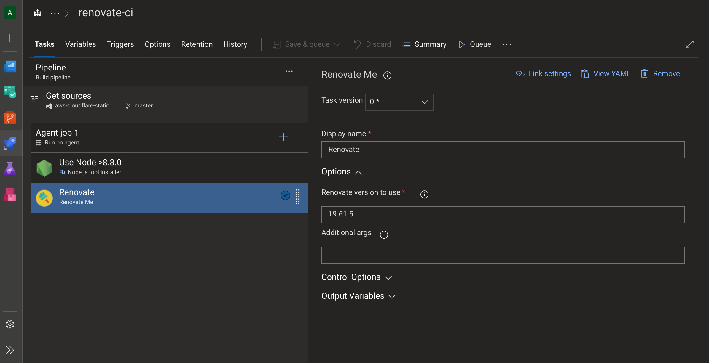
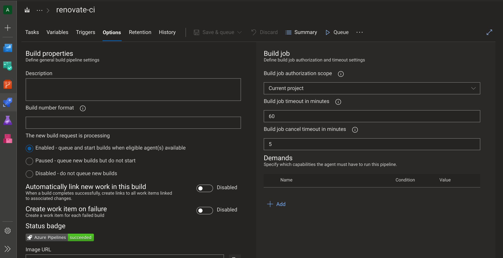
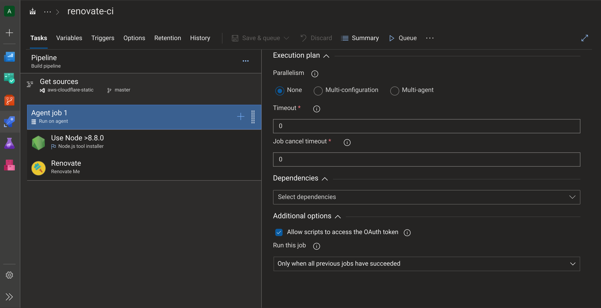
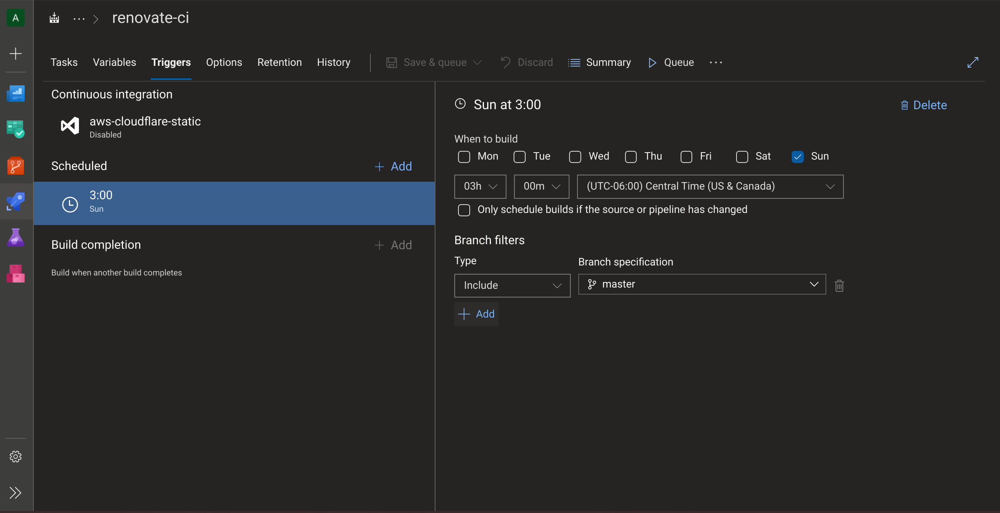
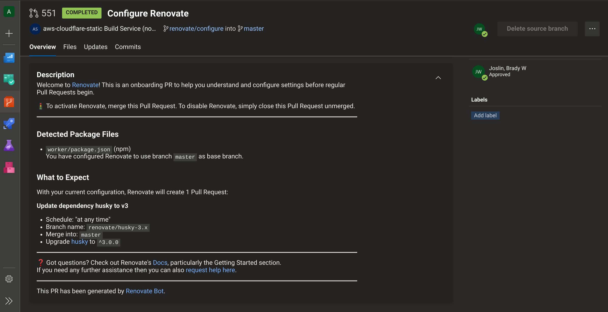
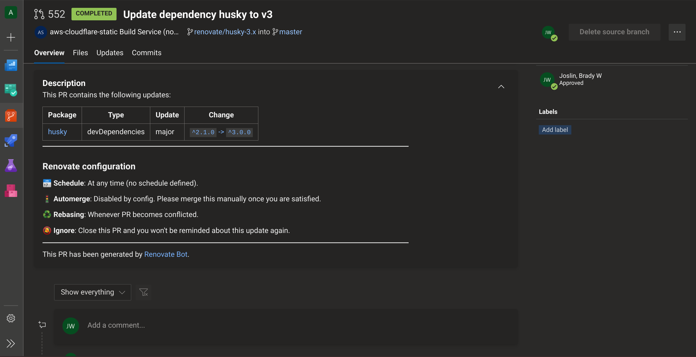

+++
title = "Automated Dependency Updates with Renovate"
date = 2019-11-16
weight = 1
order = 1
insert_anchor_links = "right"
[taxonomies]
categories = ["Cloudflare", "Development"]
tags = ["automation", "development", "security"]
+++

Keeping project dependencies up to date is foundational for ensuring application security and reliability. A 2017 [study](https://www.sciencedaily.com/releases/2017/10/171016122145.htm) by North Carolina State University found that "projects with automated pull requests made 60 percent more of the necessary upgrades than projects that didn't use incentives". One such solution, [Renovate Bot](https://renovate.whitesourcesoftware.com/), was purchase by [WhiteSource](WhiteSource) this week, who [open sourced the tool for free](https://github.com/renovatebot/renovate) 🍺. Yesterday I gave it a try and found it very easy to add to an existing project in Azure DevOps.

<!-- more -->

[OWASP's top 10, Using Components with Known Vulnerabilities](https://www.owasp.org/index.php/Top_10-2017_A9-Using_Components_with_Known_Vulnerabilities) reports "some of the largest breaches to date have relied on exploiting known vulnerabilities in components", including the recent [Equifax breach](https://www.wired.com/story/equifax-breach-no-excuse/). According to [Contrast Security](https://cdn2.hubspot.net/hub/203759/file-1100864196-pdf/docs/Contrast_-_Insecure_Libraries_2014.pdf), "applications commonly use 30 or more libraries, which can comprise up to 80% of the code in an application".

With Renovate Bot you create a periodically scheduled build pipeline which analyzes the dependencies in your project. When an update for a dependency is detected, the service automatically creates a pull request to update the relevant packages, and provides some analysis on the change. This is a fantastically simple way to have a bot contribute to your code to keep it better maintained and secure.

The first step was to add the [Renovate Bot extension](https://marketplace.visualstudio.com/items?itemName=jyc.vsts-extensions-renovate-me&ssr=false#overview) to our Azure DevOps account. Then, pick a project and create a new build pipeline that runs on an Azure DevOps hosted Linux Container, installs Node, and uses the Renovate build task. The only tricky part was I had to overwrite using the "latest" version of Renovate to [version 19.61.5](https://github.com/jycouet/VSTSExtensions/issues/23#issuecomment-544911982).



Then, in the build options, set the scope to "Current Project"



And enable the Agent Job setting to allow the build script to access the OAuth Token.



In the project settings, Allow the project's build service to create PRs and branches. (Note: this build service account wasn't present in my settings until I triggered the first Renovate Bot build.)

Then, schedule your build to run on a cron job to your liking, for example, every Sunday at 3pm. Uncheck the box, "Only schedule builds if the source or pipeline has changed".



Then, manually run the pipeline, which will automatically create Renovate's first PR on your project. The service is compatible with a wide range of dependency types, which can be found in the [documentation](https://docs.renovatebot.com/configuration-options/). One caveat for .NET projects:

> The nuget configuration object is used to control settings for the NuGet package manager. The NuGet package manager supports SDK-style .csproj format, as described [here](https://natemcmaster.com/blog/2017/03/09/vs2015-to-vs2017-upgrade/). This means that .NET Core projects are all supported but any .NET Framework projects need to be updated to the new .csproj format in order to be detected and supported by Renovate.

This PR will be to add a renovate.json file to your project and provide you some information about the service and what it has detected in the project.



After you accept this initial PR, your Renovate Bot will start providing PR's for outdated dependencies in your project. 👏



If you prefer to use [YAML pipelines](https://docs.microsoft.com/en-us/azure/devops/pipelines/yaml-schema?view=azure-devops&tabs=schema%2Cparameter-schema), here's what the pipeline definition for the sample described above would look like.

```yaml
schedules:
  - cron: "0 0 * * Sun"
    displayName: Weekly on Sunday
    branches:
      include:
        - master
    always: true

pool:
  vmImage: "ubuntu-latest"

steps:
  - checkout: self
    clean: true
    persistCredentials: true
  - task: NodeTool@0
    displayName: "Use Node >8.8.0"
    inputs:
      versionSpec: ">8.8.0"
      checkLatest: true
  - task: RenovateMe@0
    displayName: Renovate
    inputs:
      renovateOptionsVersion: 19.61.5
```
