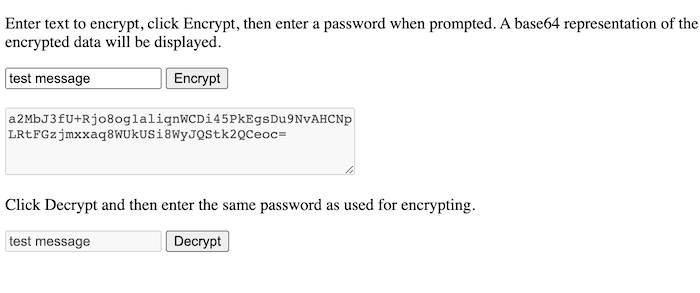

+++
title = "Password Encrypting Data with Web Crypto"
date = 2020-08-19
weight = 1
order = 1
insert_anchor_links = "right"
[taxonomies]
categories = ["Development", "Crypto"]
tags = ["development", "cryptography"]
+++

Web Crypto is a cryptography API available in modern browsers and in the cloud with Cloudflare Workers that can be used to password encrypt data. This basic example encrypts and decrypts values in the browser. AES-GCM encryption and decryption keys are derived from a password based key (PBKDF2). The encrypted output is written to and read from the DOM, but such a solution could be used to store encrypted values on a server or database.

<!-- more -->

## What We'll Build

In this example, we're going to build a simple HTML page that password encrypts a string of text and converts it to a Base64 string, then decrypts that value from an encrypted Base64 string to the original value. All of this will be done using client-side JavaScript.

Screenshot:



> **Note:** The full example source code is on GitHub at [bradyjoslin/webcrypto-example](https://github.com/bradyjoslin/webcrypto-example). A working version can be found at [bradyjoslin.github.io/webcrypto-example](https://bradyjoslin.github.io/webcrypto-example/).

## Steps to Encrypt

1. **Create a password based key (PBKDF2) that will be used to derive the AES-GCM key used for encryption / decryption.**

   We'll create a function called `getPasswordKey` that uses Web Crypto's `importKey` method to create a PBKDF2 crypto key. PBKDF2 is a key derivation function, meaning PBKDF2 keys are used as input to derive other keys.

   ```ts
   const getPasswordKey = (password) =>
     window.crypto.subtle.importKey(
       "raw",
       enc.encode(password),
       "PBKDF2",
       false,
       ["deriveKey"]
     );
   ```

1. **Create an AES-GCM key using the PBKDF2 key and a randomized salt value.**

   Next we derive an AES-GCM SHA-256 crypto key from the password protected PBKDF2 key. The derivation function includes randomization elements and computational overhead implemented through the number of iterations specified, which work together to prevent brute force attacks against encrypted data.

   ```ts
   const deriveKey = (passwordKey, salt, keyUsage) =>
     window.crypto.subtle.deriveKey(
       {
         name: "PBKDF2",
         salt: salt,
         iterations: 250000,
         hash: "SHA-256",
       },
       passwordKey,
       { name: "AES-GCM", length: 256 },
       false,
       keyUsage
     );
   ```

1. **Encrypt the input data using the AES-GCM key and a randomized initialization vector (iv).**

   Now we have the function we need in place to perform the encryption. The `encryptData` function takes in the data you want to encrypt, a password, and the number of iterations for the key derivation function to perform.

   The `salt` and the initialization vector `iv` are generated using Web Crypto's `getRandomValues` method. Then, we generate our PBKDF2 and AES-GCM keys using our previous defined functions. Crypto's `encrypt` function is used to encrypt the data using the AES-GCM key, which returns the encrypted data as an ArrayBuffer.

   ```ts
    async function encryptData(secretData, password) {
      try {
        const salt = window.crypto.getRandomValues(new Uint8Array(16));
        const iv = window.crypto.getRandomValues(new Uint8Array(12));
        const passwordKey = await getPasswordKey(password);
        const aesKey = await deriveKey(passwordKey, salt, ["encrypt"]);
        const encryptedContent = await window.crypto.subtle.encrypt(
          {
            name: "AES-GCM",
            iv: iv,
          },
          aesKey,
          new TextEncoder().encode(secretData)
        );

        const encryptedContentArr = new Uint8Array(encryptedContent);
    ...
   ```

   In order to eventually decrypt the data, we'll need to know a few things in addition to the password:

   - the number of `iterations` used to generate the AES-GCM key
   - the `salt` value used to generate the AES-GCM key
   - the `iv` value used to encrypt the content

   The `salt` and `iv` values should be different for every encrypted value. The number of `iterations` used for decryption could change over time, so not all encrypted data stored may have used the same number of iterations. Therefore, we'll include these values as a prefix to the encrypted data in the ArrayBuffer. The password should remain secret.

   Lastly, we used a helper function, `buff_to_base64` to convert the ArrayBuffer to a Base64 string.

   ```ts
     ...
        let buff = new Uint8Array(
          salt.byteLength + iv.byteLength + encryptedContentArr.byteLength
        );
        buff.set(salt, 0);
        buff.set(iv, salt.byteLength);
        buff.set(
          new Uint8Array(encryptedContentArr),
          salt.byteLength + iv.byteLength
        );
        const base64Buff = buff_to_base64(buff);
        return base64Buff;
      } catch (e) {
        console.log(`Error - ${e}`);
        return "";
      }
    }

    const buff_to_base64 = (buff) => btoa(String.fromCharCode.apply(null, buff));
   ```

## Steps to Decrypt

1. **Derive the salt, iv, and encrypted data from the Base64 string.**

   As mentioned in the final step of the decryption process, in order to decrypt our data we'll need to know the:

   - number of `iterations` used to generate the AES-GCM key
   - `salt` value used to generate the AES-GCM key
   - `iv` value used to encrypt the content

   All of the values were stored as a prefix to the encrypted portion of the ArrayBuffer containing our data. Therefore, we'll define a function `decryptData` whose first task will be to derive that information.

   ```ts
   // Convert Base64 string to ArrayBuffer
   const base64_to_buf = (b64) =>
      Uint8Array.from(atob(b64), (c) => c.charCodeAt(null));

    async function decryptData(encryptedData, password) {
      try {
        const encryptedDataBuff = base64_to_buf(encryptedData);
        const salt = encryptedDataBuff.slice(0, 16);
        const iv = encryptedDataBuff.slice(16, 16 + 12);
        const data = encryptedDataBuff.slice(16 + 12);
    ...
   ```

1. **Create a password based key (PBKDF2) that will be used to derive the AES-GCM key used for encryption / decryption.**

   The setup for decryption is very similar to encryption - create a PBKDF2 key, use it to derive an AES-GCM key. The password must be the same used for encryption.

   ```ts
   ...
        const passwordKey = await getPasswordKey(password);
   ...
   ```

1. **Create an AES-GCM key using the PBKDF2 key and the salt from the ArrayBuffer.**

   Key derivation is just as we did with encryption.

   ```ts
   ...
        const aesKey = await deriveKey(passwordKey, salt, ["decrypt"]);
   ...
   ```

1. **Decrypt the input data using the AES-GCM key and the iv from the ArrayBuffer.**

   Finally, use Web Crypto's `decrypt` method to decrypt the data, which is returned as an Promise for an ArrayBuffer. Then, we'll convert the Array Buffer to a string.

   ```ts
   ...

        const decryptedContent = await window.crypto.subtle.decrypt(
          {
            name: "AES-GCM",
            iv: iv,
          },
          aesKey,
          data
        );
        return new TextDecoder().decode(decryptedContent);
      } catch (e) {
        console.log(`Error - ${e}`);
        return "";
      }
    }
   ```

The full source code for this example, including the functions to interact with the DOM, and content of the HTML pages can be found [here](https://github.com/bradyjoslin/webcrypto-example/blob/master/script.js).

## Supplemental Resources

[Ernie Turner's](https://twitter.com/erniewturner) [Dodging Web Crypto API Landmines](https://www.youtube.com/watch?v=lbt2_M1hZeg) talk is an excellent, easy to understand overview for using Web Crypto.

[encrypt-workers-kv](https://www.npmjs.com/package/encrypt-workers-kv) is an npm package that uses the methods described here to provide wrappers on the `put` and `get` functions from the Cloudflare Workers runtime API for writing to and reading from Workers KV. Check it out for a full example of the technique mentioned here or if you need a solution specific to Workers KV.
