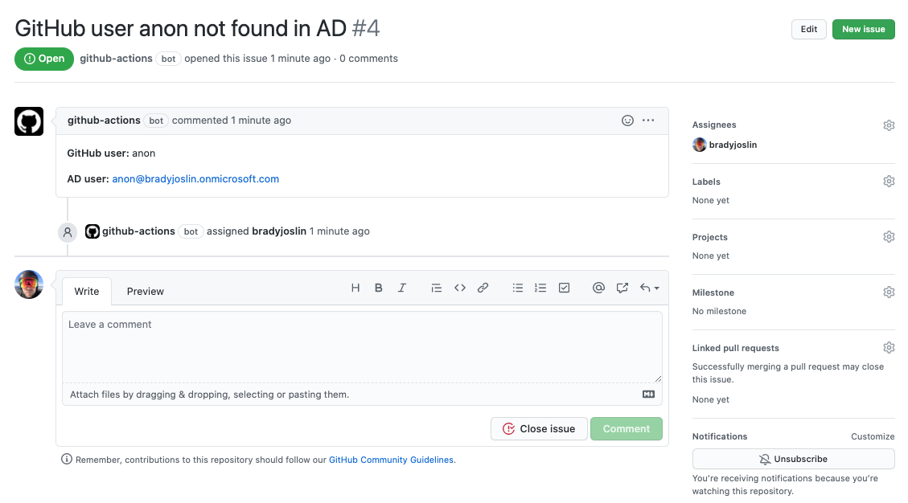

+++
title = "Use GitHub Actions + Azure AD to Govern GitHub Organization Members"
date = 2020-08-29
weight = 1
order = 1
insert_anchor_links = "right"
[taxonomies]
categories = ["Development", "GitHub Actions", "Graph API"]
tags = ["devops", "development", "identity"]
+++

Manually maintaining member access in GitHub Organizations not integrated with single sign-on can be a challenge. GitHub Actions is a flexible automation platform that can be leveraged to create a cost-effective identity governance solution to help address this problem.

<!-- more -->

Let's walk through the steps to build a GitHub Action using TypeScript that checks if all of your [GitHub Organization](https://docs.github.com/en/github/setting-up-and-managing-organizations-and-teams/about-organizations) members have valid company Azure AD accounts. If anyone is not found in Azure AD, raise an issue and assign it to the GitHub org admin.

## Initial Setup

Start off by creating a base TypeScript project with the following command, answering `Y` when asked if you want to create a `package.json` file.

```sh
npx gts init
```

Add this to the compiler options in `tsconfig.json`:

```json
"skipLibCheck": true
```

Open `package.json` and enter a value for the package `name` and under the scripts section add:

```json
"start": "node ."
```

We'll need a place to store the relationship between a GitHub user and their Azure AD account. We're going to keep this simple and manually maintain a list in a JSON file `data/userlist.json`, containing matches between all GitHub users in this org to their email address in Azure AD. At this point, intentionally include at least one good and one bad email address so we can test. Here is a sample JSON file.

```json
[
  {
    "email": "Joe@bradyjoslin.onmicrosoft.com",
    "githubid": "JoeSmith"
  },
  {
    "email": "anon@bradyjoslin.onmicrosoft.com",
    "githubid": "anon"
  }
]
```

Go ahead and create a [new repo](http://repo.new/) in your GitHub organization for this project, as well.

## Register an App in Azure AD

In order to interact with the Microsoft Graph API, we'll need to register an app in Azure AD, instructions for which can be found [here](https://docs.microsoft.com/en-us/graph/auth-register-app-v2). You'll also need to [generate a client secret](https://docs.microsoft.com/en-us/azure/active-directory/develop/howto-create-service-principal-portal#create-a-new-application-secret). Once you register the application, click `API Permissions` in the left menu and add the permission for Microsoft Graph of type `Application` with access to `User.Read.All`, which will require [admin consent](https://docs.microsoft.com/en-us/azure/active-directory/develop/application-consent-experience) to provision.

## Configure Project Secrets

The following will need to be configured in the GitHub Action's repo as [secrets](https://docs.github.com/en/actions/configuring-and-managing-workflows/creating-and-storing-encrypted-secrets):

| secret      | value                                                       |
| ----------- | ----------------------------------------------------------- |
| TENANT_NAME | Azure AD tenant name (e.g. `{tenant_name}.onmicrosoft.com`) |
| APP_ID      | App ID from Azure AD                                        |
| APP_SECRET  | your Azure AD client secret                                 |

We'll use the `dotenv` package to help make the secrets available for testing locally:

```sh
npm i dotenv
```

Create a file, `.env` in the root directory of your project and configure your secrets:

```sh
TENANT_NAME = "{tenant_name}.onmicrosoft.com"
APP_ID = "some_id"
APP_SECRET = "some_secret"
```

> 🚨 Be sure to add `.env` to your `.gitignore` to avoid publishing your secrets to your repository.

## Validate Users In Azure AD

To interact with the Graph API we're going to use two [PnPjs libraries](https://pnp.github.io/pnpjs/), which are "a collection of fluent libraries for consuming SharePoint, Graph, and Office 365 REST APIs in a type-safe way." Let's go ahead and install the packages we'll use:

```sh
npm i @pnp/graph-commonjs
npm i @pnp/nodejs-commonjs
```

OK, time to start writing some code! Let's begin by setting up our imports:

```ts
// src/index.ts
import { graph } from "@pnp/graph-commonjs";
import { AdalFetchClient } from "@pnp/nodejs-commonjs";
import { HttpRequestError } from "@pnp/odata-commonjs";
import * as fs from 'fs';
import * as util from 'util';

// Allows awaiting the file read
const readFile = util.promisify(fs.readFile);

// If running locally, you can set secrets in .env file,
// and this loads them up for the script.
require("dotenv").config();
...
```

Create a type to represent our stored user data:

```ts
...
interface User {
  email: string;
  githubid: string;
}

type Users = [User];
...
```

Our main function will get the values from `userlist.json`, loop through each user in the list, reach out to Azure AD to see if there is an existing user with a matching email address, and log to the console whether or not a matching user account was found.

```ts
...
async function run() {
  const userList = await readFile("./data/userlist.json", "utf8");
  const knownUsers: Users = JSON.parse(userList);

  const tenantName = process.env.TENANT_NAME || "";
  const appId = process.env.APP_ID || "";
  const appSecret = process.env.APP_SECRET || "";

  if (tenantName === "" && appId === "" && appSecret === "") {
    throw "Graph API AAD configuration information not found.";
  }

  graph.setup({
    graph: {
      fetchClientFactory: () =>
        new AdalFetchClient(tenantName, appId, appSecret),
    },
  });

  users.forEach(async (user) => {
    try {
      // Check if user account found in AD
      await graph.users.getById(user.email)();

      console.log(`${user.githubid} | ${user.email} ... ok `);
    } catch (e) {
      // Employee not found condition is wrapped in HttpRequestError
      if (e?.isHttpRequestError) {
        const err = await (<HttpRequestError>e).response.json();

        // Checks if the error was employee not found
        if (err.error.code === "Request_ResourceNotFound") {
          console.log(`${user.githubid} | ${user.email} ... not found!`);
        } else {
          // Something unexpected happened
          console.log(`🐛 ${err.error.message}`);
        }
      }
    }
  });
}

run();
```

## Run and Test Locally

Compile and run your script with:

```sh
npm run compile
npm run start
```

You should see output that looks like:

```text
JoeSmith | Joe@bradyjoslin.onmicrosoft.com ... ok
anon | anon@bradyjoslin.onmicrosoft.com ... not found!
```

## Automatically Create GitHub Issues

Now let's add functionality to create an issue in GitHub when a user is not found in Azure AD instead of just logging out the results to the console. Define an interface to represent an issue:

```ts
interface Issue {
  title: string;
  body: string;
  assignee: string;
}
```

The `@actions/github` library will help us interact with the GitHub API, so let's install it:

```sh
npm i @actions/github
```

And `require` the library by adding this line to the top of our `src/index.ts` file:

```ts
const github = require("@actions/github");
```

Our issue creation function obtains permission to create an issue in the repo by using an environment variable `GITHUB_TOKEN`. You do not have to configure this as a GitHub secret, it is [automatically provided by GitHub](https://docs.github.com/en/actions/configuring-and-managing-workflows/authenticating-with-the-github_token) when the workflow is run. Since this token will only be available when running in a GitHub context, we'll check for its presence and skip if not found.

```ts
async function createIssue(issue: Issue) {
  const github_token = process.env.GITHUB_TOKEN || "";

  // If GitHub token not found, not running in GitHub context, so skip creating issue
  if (github_token !== "") {
    const octokit = github.getOctokit(github_token);
    const context = github.context;

    octokit.issues.create({
      ...context.repo,
      ...issue,
    });
  }
}
```

Add a call to `createIssue` from our main function, just after where we console log our `Request_ResourceNotFound` error:

```ts
...
        // Checks if the error was employee not found
        if (err.error.code === "Request_ResourceNotFound") {
          console.log(`${user.githubid} | ${user.email} ... not found!`);

          const issue: Issue = {
            title: `GitHub user ${user.githubid} not found in AD`,
            body: `**GitHub user:** ${user.githubid}\n\n**AD user:** ${user.email}`,
            assignee: 'some_admin',  // The GitHub username of your org admin
          }

          await createIssue(issue)

        } else {
...
```

## Run the Workflow on GitHub

Lastly, we'll define our workflow file. Create `./github/workflows/audit.yml` and populate it as follows:

```yaml
name: GitHub-User-Audit

on:
  workflow_dispatch:
  schedule:
    - cron: "0 14 * * *"

jobs:
  bot:
    runs-on: ubuntu-latest
    steps:
      - uses: actions/checkout@v1
      - name: "Install NPM dependencies"
        run: npm install
      - name: "Run audit"
        run: npm run start
        env:
          TENANT_NAME: ${{ secrets.TENANT_NAME }}
          APP_ID: ${{ secrets.APP_ID }}
          APP_SECRET: ${{ secrets.APP_SECRET }}
          GITHUB_TOKEN: ${{ secrets.GITHUB_TOKEN }}
```

`workflow_dispatch` allows us to run our workflow manually from within the GitHub UI, and we've set a cron rule to run every day at 14 UTC. We're passing in the secrets we configured related to our Azure AD application, as well as the `GITHUB_TOKEN`.

Go ahead and push your code to your GitHub repo. Go to the Action section of the repo and under `GitHub-User-Audit` select `Run workflow` press the `Run workflow` button. After the run is completed you should see a new issue created related to the bad user you entered in your `userlist.json` file.



## Finish Up

Now you should be able to complete entries in the `userlist.json` file for all of the members of your GitHub organization. Every day, if any users are removed from Azure AD, you will automatically be assigned an issue in GitHub to take action.

To tidy this up, you'd probably want to check for an existing issue for a given user before creating the issue to avoid duplicates.

You could enhance this by adding an additional check to see if there are any GitHub members in your organization not setup in the `userlist.json` file. Or you could automatically remove users from your GitHub organization instead of just creating an issue. This is just to get you started, the rest is up to you!
