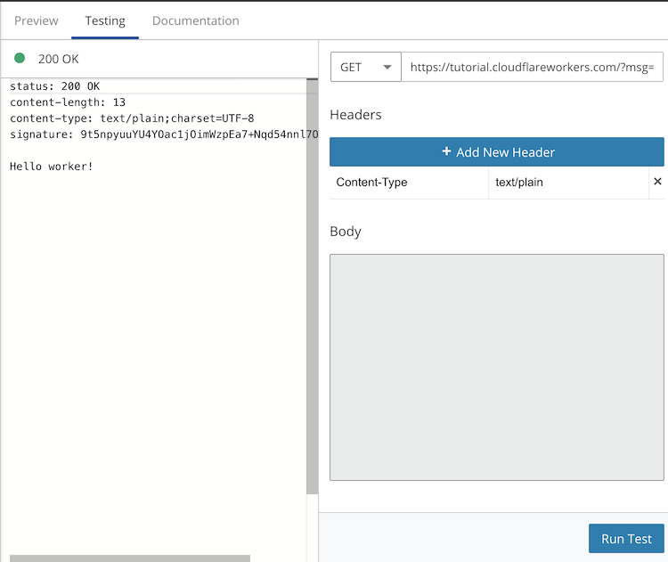
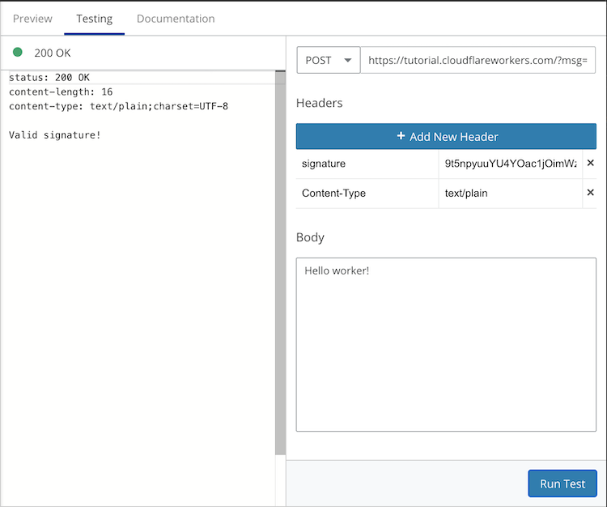

+++
title = "Signing and Verifying HMAC Signatures using Web Crypto with Cloudflare Workers"
date = 2020-08-16
weight = 1
order = 1
insert_anchor_links = "right"
[taxonomies]
categories = ["Development", "Crypto", "Cloudflare"]
tags = ["devops", "development", "cryptography", "cloudflare"]
+++

How to verify an HMAC signature using Web Crypto - an API available in modern browsers and Cloudflare Workers.

<!-- more -->

## Web Crypto

Web Crypto is a low level API for performing cryptographic functions such as encryption, decryption, and signature verification. The API is a [W3C recommendation](https://www.w3.org/TR/WebCryptoAPI/) and some of the better documentation can be found on [MDN](https://developer.mozilla.org/en-US/docs/Web/API/SubtleCrypto).

Cloudflare Workers has native support of most of the Web Crypto API. The details are listed in their [documentation](https://developers.cloudflare.com/workers/reference/apis/web-crypto/).

## Hashed-Based Message Authentication Code (HMAC)

HMAC is a hashing function that can be used as a way to sign and verify messages to ensure authenticity and is described in [RFC2104](https://www.ietf.org/rfc/rfc2104.txt).

In typical usage, a shared key is used generate a signature of a message. The signature is provided along with the message by the sender. The receiver uses their copy of the shared secret to verify the signature provided is valid to know whether or not to trust the message.

## Verifying HMAC Signatures with Cloudflare Workers

In this sample scenario we're going to create a sample [Cloudflare Worker](https://developers.cloudflare.com/workers/) that provides two main services:

1. GET -> reply with an HTTP response header set to the signature for the text provided as a query string
1. POST -> check the validity of base64 signature provided as an HTTP header for message in the HTTP body

We'll start by defining our shared secret. For a real life implementation, you'd want to configure this as a [Worker Secret](https://developers.cloudflare.com/workers/tooling/wrangler/secrets/) instead of hard coding the value.

```ts
const SECRET = "SECRET_KEY";
```

Web Crypto's `sign` and `verify` methods require a crypto key as input, so we'll create a function to provide one based on the shared secret using the [`importKey`](https://developer.mozilla.org/en-US/docs/Web/API/SubtleCrypto/importKey) method, which has the format:

```ts
const result = crypto.subtle.importKey(
  format,
  keyData,
  algorithm,
  extractable,
  usages
);
```

The [`raw`](https://developer.mozilla.org/en-US/docs/Web/API/SubtleCrypto/importKey#Raw) format will be used and the `keyData` will be the shared secret encoded as an `Uint8Array`. Extractable will be set to `false` and `usages` should allow the key to be used for both signing and verifying.

Based on this criteria, here is our `importKey` function:

```ts
async function importKey(secret) {
  return await crypto.subtle.importKey(
    "raw",
    new TextEncoder().encode(secret),
    { name: "HMAC", hash: "SHA-256" },
    false,
    ["sign", "verify"]
  );
}
```

A function called `signResponse` will be used for deriving signatures. Our function will accept a `message` as `string` and `secret` as `string` and respond with the HMAC signature for the message in base64 format. The function will use the Web Crypto [`sign`](https://developer.mozilla.org/en-US/docs/Web/API/SubtleCrypto/sign) method to create the signature, which has the following syntax:

```ts
const signature = crypto.subtle.sign(algorithm, key, data);
```

We'll use the previously defined `importKey` function to derive the key and since the `message` a string and the data needs to be an `ArrayBuffer`, we'll once again use a `TextEncoder` to convert the type.

```ts
async function signResponse(message, secret) {
  const key = await importKey(secret);
  const signature = await crypto.subtle.sign(
    "HMAC",
    key,
    new TextEncoder().encode(message)
  );

  return btoa(String.fromCharCode(...new Uint8Array(signature)))
}
}
```

For signature verification, we'll use the [`verify`](https://developer.mozilla.org/en-US/docs/Web/API/SubtleCrypto/verify) Web Crypto method:

```ts
const result = crypto.subtle.verify(algorithm, key, signature, data);
```

The `verifySignature` will take in a `message` as `string`, `signature` as a base64 `string`, and a `secret` as `string`. It will return a `Promise` for a `boolean`.

```ts
async function verifySignature(message, signature, secret) {
  const key = await importKey(secret);

  // Convert Base64 to Uint8Array
  const sigBuf = Uint8Array.from(atob(signature), (c) => c.charCodeAt(0));

  return await crypto.subtle.verify(
    "HMAC",
    key,
    sigBuf,
    new TextEncoder().encode(message)
  );
}
```

### Run Example in the Workers Playground

> [Click here](https://cloudflareworkers.com/#a2c9fe9b1cdff611bdecfa9142c0c1ce:https://tutorial.cloudflareworkers.com/?msg=Hello%20worker!) to preview a fully functioning version of this sample in the [Workers Playground](https://developers.cloudflare.com/workers/tooling/playground/).

After opening the preview of this project, switch to the `Testing` tab on the right to run the sample. To test signing, submit a `GET` request with a query string `msg` set to any text value, for example `Hello worker!`. You'll get a response with an HTTP header containing the signature for that message.



To test verifying, copy the provided signature from the `GET` request, switch the request method to `POST` and click the `Add New Header` button. Add a new header with the key `signature` and paste in the copied signature as the value. In the `Body` section paste the same message as before, i.e. `Hello worker!` and run the test. You should see an HTTP 200 OK response with `Valid signature!` as the body.



Play around with different messages and signatures to check that the Worker is properly validating the signatures. For example, modifying the body by removing the `!` in `Hello worker!` results in a 400 error with the response body stating the signature is invalid.


### Full Source Code

```ts
const SECRET = "SECRET_KEY";

addEventListener("fetch", (event) => {
  event.respondWith(handleRequest(event.request));
});

async function handleRequest(request) {
  if (request.method === "GET") {
    const url = new URL(request.url);
    const msg = url.searchParams.get("msg") || "";
    const signature = await signResponse(msg, SECRET);
    let response = new Response(msg);
    response.headers.set("signature", signature);

    return response;
  } else if (request.method === "POST") {
    const message = await request.text();
    const signature = request.headers.get("signature") || "";
    const isSigValid = await verifySignature(message, signature, SECRET);

    return isSigValid
      ? new Response("Valid signature!")
      : new Response("Invalid signature!", { status: 400 });
  } else {
    return new Response("Method not supported");
  }
}

async function importKey(secret) {
  return await crypto.subtle.importKey(
    "raw",
    new TextEncoder().encode(secret),
    { name: "HMAC", hash: "SHA-256" },
    false,
    ["sign", "verify"]
  );
}

async function signResponse(message, secret) {
  const key = await importKey(secret);
  const signature = await crypto.subtle.sign(
    "HMAC",
    key,
    new TextEncoder().encode(message)
  );

  return btoa(String.fromCharCode(...new Uint8Array(signature)));
}

async function verifySignature(message, signature, secret) {
  const key = await importKey(secret);

  // Convert Base64 to Uint8Array
  const sigBuf = Uint8Array.from(atob(signature), (c) => c.charCodeAt(0));

  return await crypto.subtle.verify(
    "HMAC",
    key,
    sigBuf,
    new TextEncoder().encode(message)
  );
}
```
