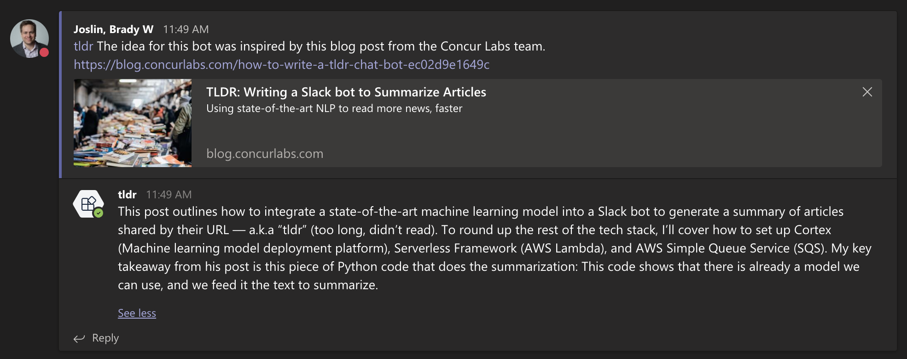

+++
title = "MS Teams Outgoing Webhook Bots with Cloudflare Workers"
date = 2020-06-11
weight = 1
order = 1
insert_anchor_links = "right"
[taxonomies]
categories = ["Cloudflare", "Development"]
tags = ["automation", "development"]
+++

[Outgoing webhook bots](https://docs.microsoft.com/en-us/microsoftteams/platform/webhooks-and-connectors/how-to/add-outgoing-webhook) are an easy way to add powerful automation capabilities to MS Teams. [Cloudflare Workers](https://workers.dev/) is serverless computing platform with excellent performance and global redundancy with a fantastic developer CLI called [Wrangler](https://github.com/cloudflare/wrangler). This article describes how to use the open source [msteams-webhook-worker-template](https://github.com/bradyjoslin/msteams-webhook-worker-template) to kick-start Cloudflare Worker based outgoing webhook bots for MS Teams and walks through a sample bot that uses natural language processing to provide web page summaries.  

<!-- more -->

To use the wrangler template to create a new bot project simply run:

```bash
wrangler generate <project> https://github.com/bradyjoslin/msteams-webhook-worker-template
```

### tldr - A Sample Bot

[tldr (“Too Long; Didn't Read”)](https://github.com/bradyjoslin/msteams-tldr/) is a sample open source bot built using the wrangler template.  When @mentioned in a post or comment in a message containing a URL the bot replies with a 3-sentence summary of the web page.



The idea for tldr bot came from [this article](https://blog.concurlabs.com/how-to-write-a-tldr-chat-bot-ec02d9e1649c) from the Concur Labs team and mostly implemented as a proof of concept. I wanted to explore the least complicated way of creating a similar bot by using existing services and avoid deploying any infrastructure.

### How tldr Works

When creating an outgoing webhook in MS Teams [(docs)](https://docs.microsoft.com/en-us/microsoftteams/platform/webhooks-and-connectors/how-to/add-outgoing-webhook#create-an-outgoing-webhook) you are provided an HMAC secret token that can be used to verify message signatures.  To make that secret available to your worker, add a [worker secret variable](https://developers.cloudflare.com/workers/tooling/wrangler/secrets/) named `SECRET`. This can be configured using Wrangler:

```bash
wrangler secret put SECRET
```

Teams sends the message to the worker when the bot is @mentioned via an HMAC signed POST request. The worker first verifies the webhook signature using the `SECRET` variable.

```javascript
function verifySignature(body, signature) {
  let bufSecret = Buffer.from(SECRET, 'base64')
  let msgBuf = Buffer.from(body, 'utf8')

  let msgHash =
    'HMAC ' +
    crypto
      .createHmac('sha256', bufSecret)
      .update(msgBuf)
      .digest('base64')
      
  return msgHash === signature
}
```

With the HMAC signature verified a regular expression looks for and obtains the first URL from the Teams message and calls a function to get a summary of the contents of the web page hosted at that URL.

```javascript
let json = JSON.parse(body)
let message = json.text

let urlMatcher = /(?<=a href=?")([h]t{1,2}ps?:\/\/.*?)(?=")/.exec(message)
let url = urlMatcher != null && urlMatcher.length ? urlMatcher[0] : ''

let summary = await getSummary(url)
```

The worker summary function makes an API call to [nlp/SummarizeURL](https://algorithmia.com/algorithms/nlp/SummarizeURL) on Algorithmia's algorithm-as-a-service platform which first converts the HTML from the provided URL to text, then uses natural language processing to summarize that text into three sentences.  To call the API you have to sign up for a free [Algorithmia](https://algorithmia.com/) account and obtain an API key.  Add a worker secret variable named `ALGO_KEY` to share the API Key to your worker.

```bash
wrangler secret put ALGO_KEY
```

Cloudflare workers makes outbound HTTP call to Algorithmia using the standard [Fetch API](https://developers.cloudflare.com/workers/reference/apis/fetch/).

```javascript
async function getSummary(url) {
  let algo =
    'https://api.algorithmia.com/v1/algo/nlp/SummarizeURL/0.1.4?timeout=300'
  let summary = await fetch(algo, {
    method: 'POST',
    headers: {
      Authorization: ALGO_KEY,
    },
    body: url,
  })
    .then(res => res.json())
    .then(json => json.result)

  return summary
}
```

Then the worker replies to Teams with a JSON response containing the summarized text.

```javascript
return new Response(`{"type": "message","text": "${summary}"}`, {
  headers: { 'content-type': 'application/json' },
})
```

Deployment is automated through the [Wrangler GitHub Action](https://github.com/cloudflare/wrangler-action), but could also be done locally using:

```bash
wrangler publish
```

With just 63 lines of JavaScript, the majority of which is provided by the project template, and a few configuration steps we were able to make a Teams bot with some fairly interesting functionality.  

🎉
